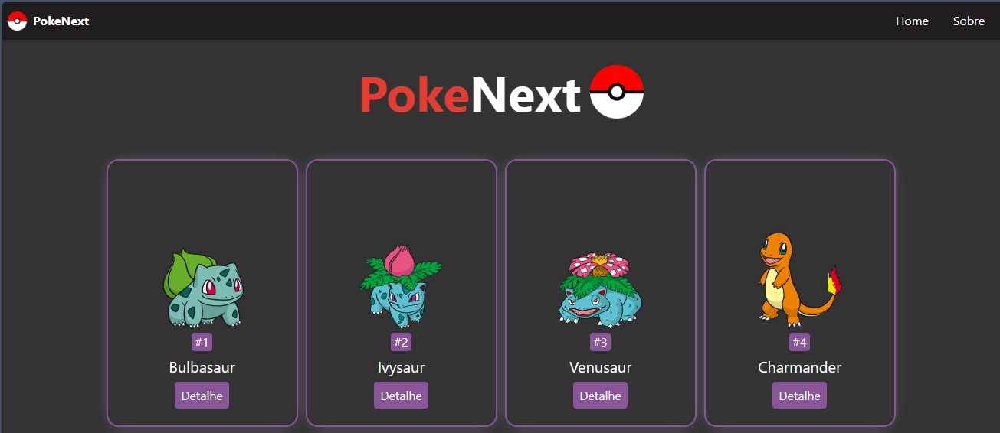
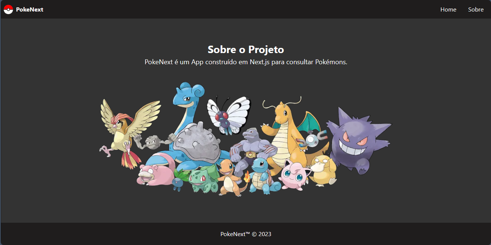
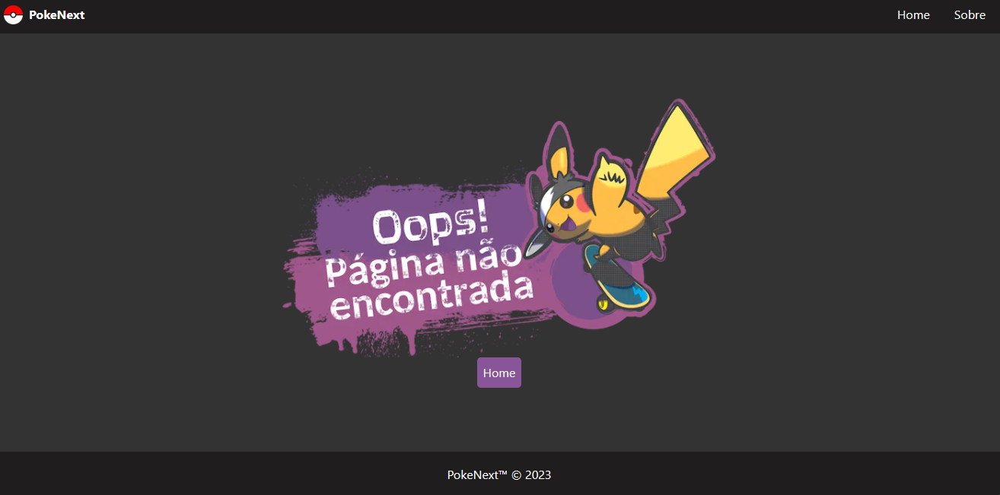

<h1 align="center">
  
 PokeNext</a>
</h1>

Todos os seus Pokémons favoritos em um só lugar.

Acesse o site da <a href="https://rc-pokenext.vercel.app/" target="_blank">PokeNext</a>.

 <a href="#Descrição">Descrição</a> •
 <a href="#Tecnologias">Tecnologias utilizadas</a> •
 <a href="#autor">Autor</a>

---

 

<h1 align="center">  
  

    
    
  

</h1>

### Descrição

O projeto consiste em um e-commerce responsivo focando na acessibilidade e SEO. Nele é possível adicionar itens ao carrinho, escolher a quantidade de cada item, retirar itens e limpar o carrinho.

A aplicação foi desenvolvida com as tecnologias **React Js** e **Typescript** no frontend e **Node JS**, **Typescript** e **Express** no backend (<a href="https://github.com/RenCsar/TECH-shopping-api" target="_blank">veja o repositório do backend clicando aqui</a>). 

Sobre as tecnologias utilizadas: as rotas da aplicação foram feitas com o **React Router Dom**, a estilização feita com **Styled Components** e **Material UI**, o gerenciamento de estado foi feito com **Redux** (Toolkit), as requisições foram feitas com **Redux Thunk** e **Axios** e para sinalizar ao usuário possíveis erros da aplicação foi utilizado foi utilizado a biblioteca **toastify**.

### Tecnologias utilizadas

As seguintes ferramentas foram usadas na construção do projeto:

- Next JS
- Typescripts
- Tailwind
- Fetch API

---

### Autor

Made with 💜 by Renan Cesar 👋

